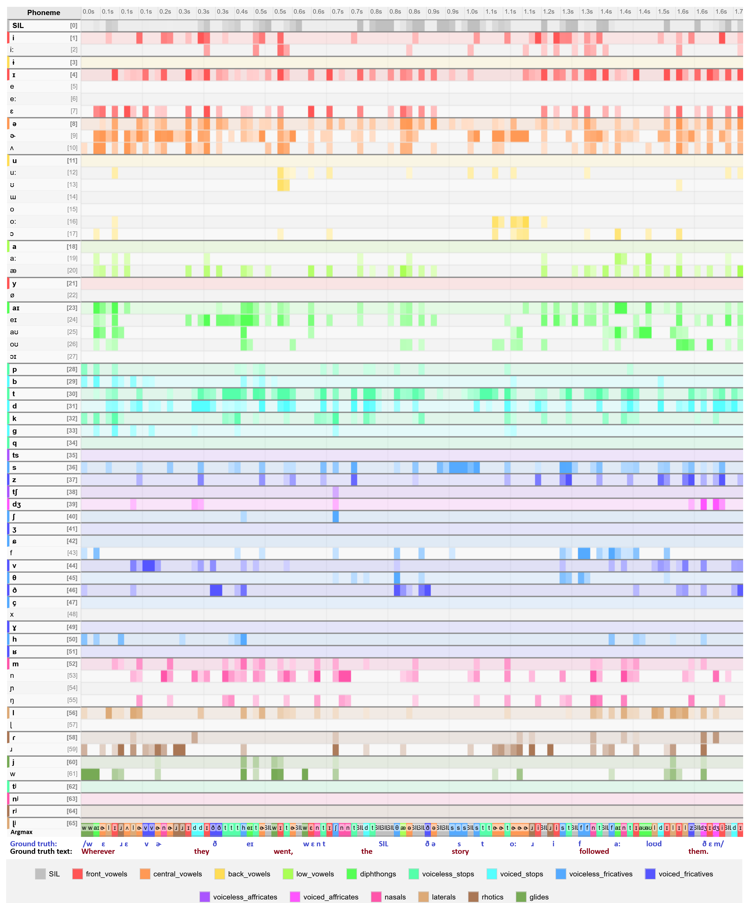
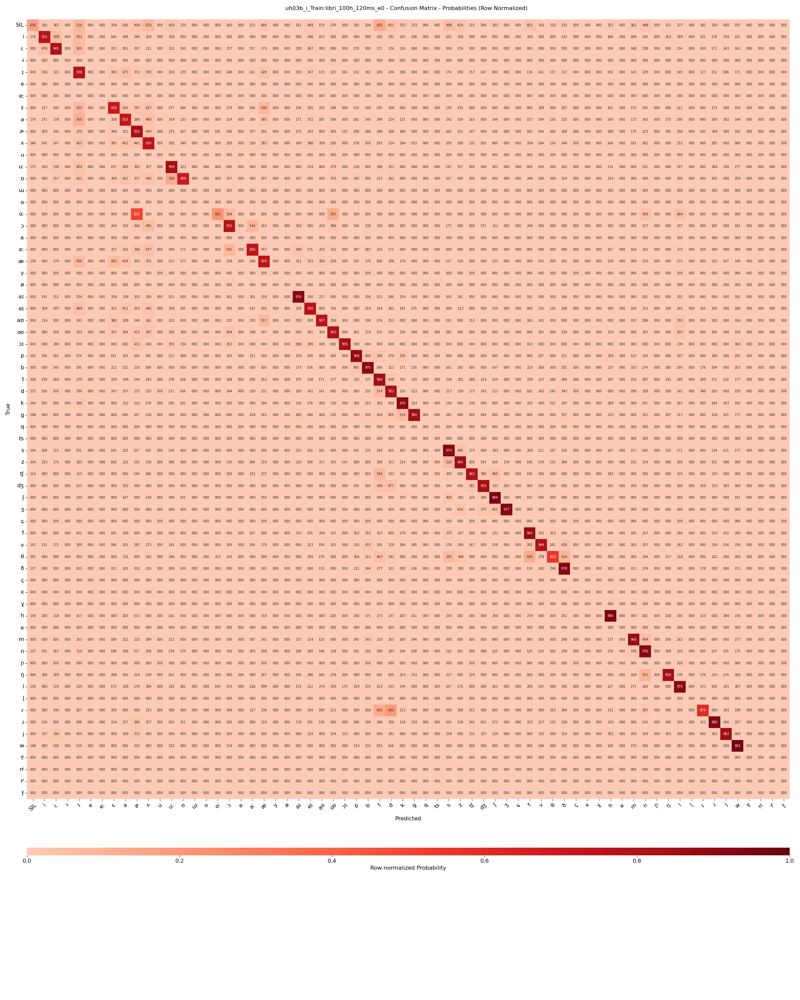

# CUPE: Contextless Universal Phoneme Encoder

A PyTorch model for contextless phoneme prediction from speech audio. CUPE processes 120ms frames independently, ensuring each frame's embeddings are acoustically pure—unlike transformer models that mix context across frames.


- Github link: [github.com/tabahi/contexless-phonemes-CUPE](https://github.com/tabahi/contexless-phonemes-CUPE)
- Huggingface link: [huggingface.co/Tabahi/CUPE-2i](https://huggingface.co/Tabahi/CUPE-2i)

## Trained Models

Two 30.1M parameter models are available in the [checkpoints directory](https://huggingface.co/Tabahi/CUPE-2i/tree/main/ckpt).

## Datasets

- **LibriSpeech ASR corpus (SR12):** 960 hours of English speech from train-100, train-360, and train-500 splits.
- **Multilingual LibriSpeech (MLS) (SLR94):** 800 hours total, with 100 hours each for 8 languages: `pl`, `pt`, `it`, `es`, `fr`, `nl`, `de`, `en`. Dataset's train/test/val splits.
- **MSWC Multilingual Spoken Words Corpus:** 240 hours from 50 languages (max 10 hours/language).
    - **Training:** 38 languages (`en`, `de`, `fr`, `ca`, `es`, `fa`, `it`, `ru`, `pl`, `eu`, `cy`, `eo`, `nl`, `pt`, `tt`, `cs`, `tr`, `et`, `ky`, `id`, `sv-SE`, `ar`, `el`, `ro`, `lv`, `sl`, `zh-CN`, `ga-IE`, `ta`, `vi`, `gn`, `or`)
    - **Testing:** 6 languages (`lt`, `mt`, `ia`, `sk`, `ka`, `as`)


## Metrics

**English ([en_libri1000_uj01d](https://huggingface.co/Tabahi/CUPE-2i/resolve/main/ckpt/en_libri1000_uj01d_e199_val_GER=0.2307.ckpt)):**
- **PER:** 0.25 (Phoneme Error Rate)
- **GER:** 0.23 (Phoneme Group Error Rate)


**Multilingual MLS ([multi_MLS8_uh02](https://huggingface.co/Tabahi/CUPE-2i/resolve/main/ckpt/multi_MLS8_uh02_e36_val_GER=0.2334.ckpt)):**
- **PER:** 0.31
- **GER:** 0.26

**Multilingual MSWC ([multi_mswc38_ug20](https://huggingface.co/Tabahi/CUPE-2i/resolve/main/ckpt/multi_mswc38_ug20_e59_val_GER=0.5611.ckpt)):**
- **PER:** 0.49
- **GER:** 0.39

---


# Quick Start

## Installation

```bash
pip install torch torchaudio huggingface_hub
```

## Easy Usage with Automatic Download

See [example.py](https://huggingface.co/Tabahi/CUPE-2i/blob/main/example.py) for a bootstrap example.

To use `huggingface_hub` to automatically download and run:

```python
import torch
import torchaudio
from huggingface_hub import hf_hub_download
import importlib.util

def load_cupe_model(model_name="english", device="auto"):
    """Load CUPE model with automatic downloading from Hugging Face Hub"""
    
    model_files = {
        "english": "en_libri1000_uj01d_e199_val_GER=0.2307.ckpt",
        "multilingual-mls": "multi_MLS8_uh02_e36_val_GER=0.2334.ckpt", 
        "multilingual-mswc": "multi_mswc38_ug20_e59_val_GER=0.5611.ckpt"
    }
    
    if device == "auto":
        device = "cuda" if torch.cuda.is_available() else "cpu"
    
    # Download files automatically from Hugging Face Hub
    repo_id = "Tabahi/CUPE-2i"
    model_file = hf_hub_download(repo_id=repo_id, filename="model2i.py")
    windowing_file = hf_hub_download(repo_id=repo_id, filename="windowing.py") 
    checkpoint = hf_hub_download(repo_id=repo_id, filename=f"ckpt/{model_files[model_name]}")
    
    # Import modules dynamically
    spec = importlib.util.spec_from_file_location("model2i", model_file)
    model2i = importlib.util.module_from_spec(spec)
    spec.loader.exec_module(model2i)
    
    spec = importlib.util.spec_from_file_location("windowing", windowing_file)
    windowing = importlib.util.module_from_spec(spec)
    spec.loader.exec_module(windowing)
    
    # Initialize model
    extractor = model2i.CUPEEmbeddingsExtractor(checkpoint, device=device)
    return extractor, windowing

# Example usage
extractor, windowing = load_cupe_model("english")

# Load and process your audio
audio, sr = torchaudio.load("your_audio.wav")
if sr != 16000:
    resampler = torchaudio.transforms.Resample(sr, 16000)
    audio = resampler(audio)

# Add batch dimension and process
audio_batch = audio.unsqueeze(0)
windowed_audio = windowing.slice_windows(audio_batch, 16000, 120, 80)
batch_size, num_windows, window_size = windowed_audio.shape
windows_flat = windowed_audio.reshape(-1, window_size)

# Get predictions
logits_phonemes, logits_groups = extractor.predict(windows_flat, return_embeddings=False, groups_only=False)

print(f"Phoneme logits shape: {logits_phonemes.shape}")  # [num_windows, frames_per_window, 66]
print(f"Group logits shape: {logits_groups.shape}")     # [num_windows, frames_per_window, 16]
```

## Advanced Usage (Manual Setup)

If you prefer to download files manually or need more control, see [run.py](https://huggingface.co/Tabahi/CUPE-2i/blob/main/run.py):

```python
import torch
import torchaudio
from model2i import CUPEEmbeddingsExtractor  # Main CUPE model feature extractor
import windowing  # Provides slice_windows, stich_window_predictions

# Load model from local checkpoint
cupe_ckpt_path = "./ckpt/en_libri1000_uj01d_e199_val_GER=0.2307.ckpt"
extractor = CUPEEmbeddingsExtractor(cupe_ckpt_path, device="cuda")

# Prepare audio
sample_rate = 16000
window_size_ms = 120
stride_ms = 80
max_wav_len = 10 * sample_rate  # 10 seconds

dummy_wav = torch.zeros(1, max_wav_len, dtype=torch.float32, device="cpu")
audio_batch = dummy_wav.unsqueeze(0)  # Add batch dimension

# Window the audio
windowed_audio = windowing.slice_windows(
    audio_batch.to("cuda"),
    sample_rate,
    window_size_ms,
    stride_ms
)
batch_size, num_windows, window_size = windowed_audio.shape
windows_flat = windowed_audio.reshape(-1, window_size)

# Get predictions
logits, _ = extractor.predict(windows_flat, return_embeddings=False, groups_only=False)

# Reshape and stitch window predictions
frames_per_window = logits.shape[1]
logits = logits.reshape(batch_size, num_windows, frames_per_window, -1)
logits = windowing.stich_window_predictions(
    logits,
    original_audio_length=audio_batch.size(2),
    cnn_output_size=frames_per_window,
    sample_rate=sample_rate,
    window_size_ms=window_size_ms,
    stride_ms=stride_ms
)

print(logits.shape)  # [B, T, 66]
```

## Available Models

| Model Name | Languages | PER | GER | Description |
|------------|-----------|-----|-----|-------------|
| `"english"` | English | 0.25 | 0.23 | Best quality for English speech |
| `"multilingual-mls"` | 8 European languages | 0.31 | 0.26 | en, de, fr, es, pt, it, pl, nl |
| `"multilingual-mswc"` | 38 languages | 0.49 | 0.39 | Broad language coverage |

## Output Format

- **Phoneme logits**: `(time_frames, 66)` - 66 IPA phoneme classes
- **Group logits**: `(time_frames, 16)` - 16 phoneme groups  
- **Time resolution**: ~16ms per frame (~62.5 FPS)
- **Mapping**: See [mapper.py](https://huggingface.co/Tabahi/CUPE-2i/blob/main/mapper.py) for phoneme-to-index mapping

## Key Features

**No manual downloads** - automatic via Hugging Face Hub  
**Multiple languages** - English + 37 other languages  
**Real-time capable** - faster than real-time on GPU  
**Frame-level timing** - 16ms resolution  
**Contextless** - each frame processed independently


# Custom dataset for training
- See [mapper.py](https://huggingface.co/Tabahi/CUPE-2i/blob/main/mapper.py) for the tokenization for 66 phonemes and 16 phoneme groups.

- Recommend using any IPA based grapheme to phoneme conversion tool. See [Espeak-ng](https://pypi.org/project/espeakng/). 
- Given word-level text, convert words to IPA phoneme sequences. See [phonemizer](https://pypi.org/project/phonemizer/3.0.1/).

- Map each individual IPA phonemes to 65 tokens: [IPAPhonemeMapper](https://github.com/tabahi/IPAPhonemeMapper). CUPE uses 65(+1) tokens mapping where token 0 is for silence, and token 65 is for blank/noise.


# Use Cases

- Timestamp alignment (examples coming soon)
- Speech analysis

## Sample probabilties timeline



## Multilingual Confusion Plot (Counts)


## English-only Confusion Plot (Probabilities)

